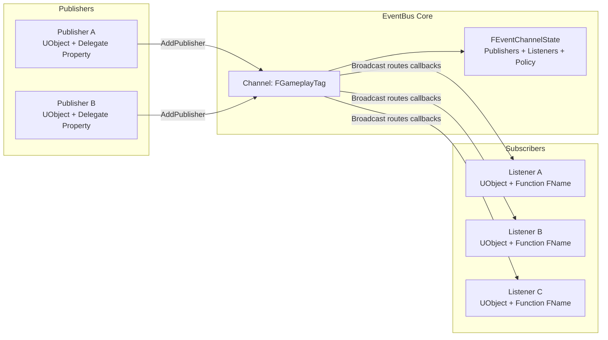
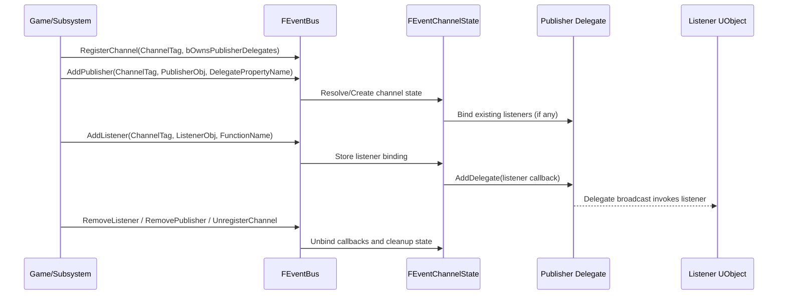
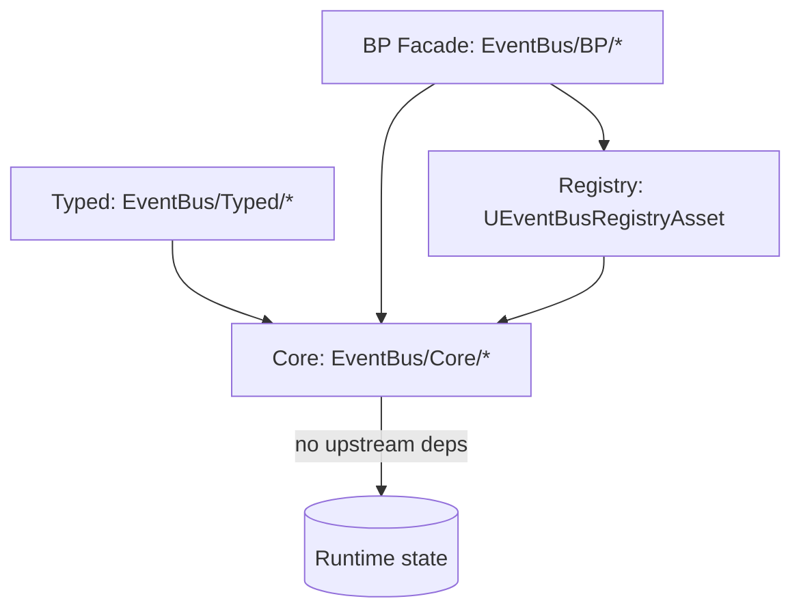
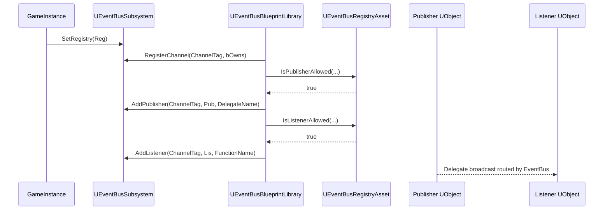

# EventBus Plugin v2 (Full Replacement)

EventBus v2 is a full rewrite of the plugin architecture with strict layering, deterministic lifecycle, and explicit channel governance.

This version intentionally removes the v1 API surface. No migration wrappers are provided.

## Compatibility

- Unreal Engine: `>= 5.5` (validated target baseline: 5.5, expected to work on 5.6+)
- C++: `>= 20` (C++20/C++23 compatible)

## Mandatory Engineering Constraints

1. Unreal Engine 5.5+ coding rules and best practices.
2. C++20+ best practices and standards.
3. Prefer Unreal Engine libraries/types over STL where practical.
4. Use well-defined GoF patterns where appropriate.
5. Maintain strong decoupling.
6. Keep naming and formatting coherent.
7. Keep comments, doxygen, and textual docs up to date.
8. Enforce clear responsibility separation between code entities.
9. Follow OOP best practices.
10. Maintain compatibility with C++ `>= 20` and Unreal Engine `>= 5.5` (5.6/5.7+ included).
11. Keep code clean, safe, and well structured.
12. Avoid workarounds and legacy code paths.
13. Apply DRY best practices and avoid unnecessary repetition.
14. Avoid dead or unreachable code.

## Design Goals

1. Explicit channel registration and policy.
2. Clean separation between Core, Typed C++, and Blueprint facade layers.
3. Per-channel ownership policy with predictable unbind behavior.
4. Pointer-based C++ listener registration (`NFL_EVENTBUS_METHOD(ClassType, FunctionName)`) with compile-time checks.
5. Blueprint listener registration via controlled allowlist registry.
6. Unreal-first implementation (`TMap`, `TArray`, `FName`, `FGameplayTag`, `TWeakObjectPtr`).
7. C++20 attribute aliases for explicit intent (`NFL_EVENTBUS_MAYBE_UNUSED`, `NFL_EVENTBUS_NODISCARD`).

## Authoritative Runtime Contract

EventBus v2 is channel-driven. A channel must be registered before binding publishers or listeners.

1. `RegisterChannel(ChannelTag, bOwnsPublisherDelegates) -> bool`
2. `UnregisterChannel(ChannelTag) -> bool`
3. `AddPublisher(ChannelTag, PublisherInstance, DelegateBinding) -> bool`
4. `RemovePublisher(ChannelTag, PublisherInstance) -> bool`
5. `AddListener(ChannelTag, ListenerInstance, ListenerFunction) -> bool`
6. `RemoveListener(ChannelTag, ListenerInstance, ListenerFunction) -> bool`

Listener identity is instance + function bound to a channel (`FObjectKey + FName` internal key).

Channel signature behavior:

- First bound publisher delegate sets channel signature.
- Additional publishers/listeners must be signature-compatible.
- Listener-first registration is supported and validated when first publisher binds.

## Pub/Sub Block Diagrams

### 1) Channel-centered pub/sub topology



### 2) Runtime bind/dispatch lifecycle



## Layered Architecture



Dependency rule set:

- Core depends on no Typed/BP headers.
- Typed depends only on Core.
- BP depends on Core and Registry.
- Registry is data-only governance; it does not depend on Subsystem/Blueprint library headers.

## File Layout

### Public

- `Plugins/EventBus/Source/EventBus/Public/EventBus/Core/EventBus.h`
- `Plugins/EventBus/Source/EventBus/Public/EventBus/Core/EventBusTypes.h`
- `Plugins/EventBus/Source/EventBus/Public/EventBus/Core/EventBusErrors.h`
- `Plugins/EventBus/Source/EventBus/Public/EventBus/Core/EventBusValidation.h`
- `Plugins/EventBus/Source/EventBus/Public/EventBus/Typed/EventChannelDef.h`
- `Plugins/EventBus/Source/EventBus/Public/EventBus/Typed/EventChannelApi.h`
- `Plugins/EventBus/Source/EventBus/Public/EventBus/BP/EventBusSubsystem.h`
- `Plugins/EventBus/Source/EventBus/Public/EventBus/BP/EventBusBlueprintLibrary.h`
- `Plugins/EventBus/Source/EventBus/Public/EventBus/BP/EventBusRegistryAsset.h`

### Private

- `Plugins/EventBus/Source/EventBus/Private/EventBusModule.cpp`
- `Plugins/EventBus/Source/EventBus/Private/Core/EventBus.cpp`
- `Plugins/EventBus/Source/EventBus/Private/Core/EventChannelState.cpp`
- `Plugins/EventBus/Source/EventBus/Private/Core/EventBusValidation.cpp`
- `Plugins/EventBus/Source/EventBus/Private/BP/EventBusSubsystem.cpp`
- `Plugins/EventBus/Source/EventBus/Private/BP/EventBusBlueprintLibrary.cpp`
- `Plugins/EventBus/Source/EventBus/Private/BP/EventBusRegistryAsset.cpp`

## API Usage (C++)

### Core runtime API (channel + names)

```cpp
#include "EventBus/Core/EventBus.h"

using namespace Nfrrlib::EventBus;

FEventBus Bus;

FChannelRegistration Reg;
Reg.ChannelTag = ChannelTag;
Reg.bOwnsPublisherDelegates = false;
Bus.RegisterChannel(Reg);

FPublisherBinding PublisherBinding;
PublisherBinding.DelegatePropertyName = TEXT("OnHealthChanged");
Bus.AddPublisher(ChannelTag, PublisherObj, PublisherBinding);

FListenerBinding ListenerBinding;
ListenerBinding.FunctionName = TEXT("HandleHealthChanged");
Bus.AddListener(ChannelTag, ListenerObj, ListenerBinding);
```

### Typed C++ API (recommended for native code)

```cpp
#include "EventBus/Typed/EventChannelDef.h"
#include "EventBus/Typed/EventChannelApi.h"

NFL_DECLARE_EVENTBUS_CHANNEL(
    FHealthChannel,
    FOnToyHealthChanged,        // delegate type
    UToyStatsPublisherComponent,// publisher class
    TAG_Event_Toy_HealthChanged,// gameplay tag
    OnToyHealthChanged          // publisher delegate property
);

using namespace Nfrrlib::EventBus;

FEventBus Bus;
TEventChannelApi<FHealthChannel>::Register(Bus, false);
TEventChannelApi<FHealthChannel>::AddPublisher(Bus, Publisher);
NFL_EVENTBUS_ADD_LISTENER(Bus, FHealthChannel, Listener, UMyListenerClass, OnHealthChanged);
```

## API Usage (Blueprint)

### Blueprint nodes exposed by `UEventBusBlueprintLibrary`

- `RegisterChannel`
- `UnregisterChannel`
- `AddPublisherValidated`
- `RemovePublisher`
- `AddListenerValidated`
- `RemoveListener`
- `GetAllowedListenerFunctions`

### Registry-governed setup

Blueprint binding is validated through `UEventBusRegistryAsset`.

Publisher allowlist tuple:

- `ChannelTag`
- `PublisherClass` (`TSubclassOf<UObject>`)
- `DelegatePropertyName`

Listener allowlist tuple:

- `ChannelTag`
- `ListenerClass` (`TSubclassOf<UObject>`)
- `AllowedFunctions` (array of `FName`)

## Blueprint Wiring Guide (Step-by-step)

### 1) Create registry asset

1. Create `EventBusRegistryAsset` in Content Browser.
2. Add publisher rules for each allowed `(ChannelTag, PublisherClass, DelegatePropertyName)`.
3. Add listener rules for each allowed `(ChannelTag, ListenerClass, FunctionName)`.

### 2) Assign registry to subsystem

At game startup (or initialization blueprint):

1. Get `GameInstance`.
2. Get subsystem `EventBusSubsystem`.
3. Call `SetRegistry(RegistryAsset)`.

### 3) Register channels

Use `RegisterChannel` node once per channel:

- `ChannelTag = Event.Toy.HealthChanged`
- `bOwnsPublisherDelegates = true/false`

### 4) Bind publisher

Call `AddPublisherValidated`:

- `ChannelTag`
- `PublisherObj`
- `DelegatePropertyName` (must match allowlist)

### 5) Bind listener

Call `AddListenerValidated`:

- `ChannelTag`
- `ListenerObj`
- `FunctionName` (must match allowlist and be bindable)

### 6) Unbind on teardown

Call `RemoveListener` and `RemovePublisher` in `EndPlay` or equivalent lifecycle point.

### Blueprint flow diagram



## Ownership Policy (`bOwnsPublisherDelegates`)

When `true`:

- Removal operations use object-wide EventBus-managed cleanup semantics per listener object.
- Useful when you want EventBus to fully own listener callback cleanup on a channel.

When `false`:

- Removal operations target only the exact callback previously bound by EventBus.
- Useful when publisher delegates may carry additional non-EventBus bindings.

## Threading and Lifecycle

- EventBus v2 APIs are game-thread only.
- `UEventBusSubsystem::Deinitialize()` calls `EventBus.Reset()` for full deterministic unbind.
- `UnregisterChannel` also performs unbind + state cleanup for that channel.

## Logging and Diagnostics

- Plugin log category: `LogNFLEventBus`.
- Validation failures return `false` and write deterministic warning logs with reason/context.

## C++20 Attribute Aliases

EventBus v2 uses local attribute aliases defined in:

- `Plugins/EventBus/Source/EventBus/Public/EventBus/Core/EventBusAttributes.h`

Available aliases:

- `NFL_EVENTBUS_MAYBE_UNUSED` for intentionally unused parameters/locals.
- `NFL_EVENTBUS_NODISCARD` and `NFL_EVENTBUS_NODISCARD_MSG(...)` for return values that should be checked.
- `NFL_EVENTBUS_UNUSED(Value)` fallback helper for contexts where attribute annotation is not applicable.

## Testing

Current automated coverage files:

- `Private/Tests/EventBusCoreTests.cpp`
- `Private/Tests/EventBusTypedApiTests.cpp`
- `Private/Tests/EventBusBlueprintValidationTests.cpp`

Recommended validation:

1. Channel-not-registered failure behavior.
2. Multi-publisher same-channel behavior.
3. Ownership policy behavior for both `true` and `false`.
4. Listener removal precision (instance + function).
5. Reset/unregister teardown leaves no stale bindings.

## Breaking Changes From v1

- `FEventBusManager` removed.
- Previous v1 headers and utility layer removed.
- v2 API requires explicit channel registration.
- Blueprint binding requires registry allowlist validation.

## Additional Docs

- `docs/EventBus_DeepReview_RemediationPlan.md`
- `docs/EventBus_v2_Architecture.md`
- `docs/EventBus_v2_API.md`
