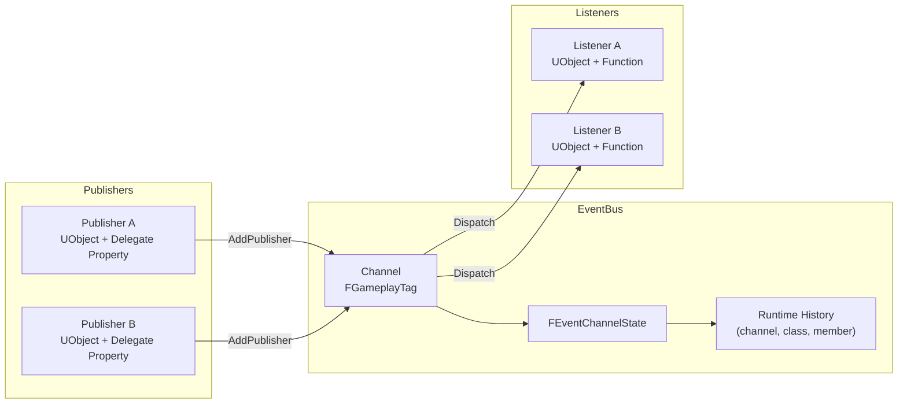
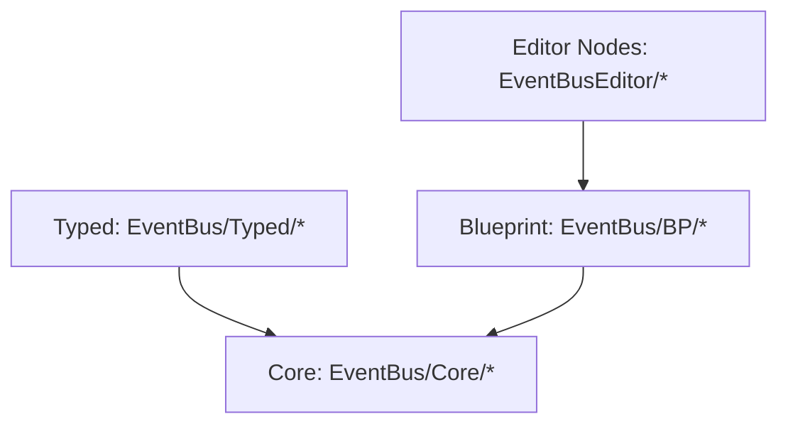

# EventBus Plugin v2 (Runtime-First)

EventBus v2 is a channel-driven pub/sub plugin for Unreal Engine with strict lifecycle handling and deterministic delegate unbind behavior.

## Compatibility

- Unreal Engine: `>= 5.5` (validated baseline: 5.5, expected to work on 5.6+)
- C++: `>= 20` (C++20 / C++23)

## Mandatory Engineering Constraints

1. Unreal Engine 5.5+ coding rules and best practices.
2. C++20+ best practices and standards.
3. Prefer Unreal Engine libraries/types over STL where practical.
4. Use well-defined GoF patterns where appropriate.
5. Maintain strong decoupling.
6. Keep naming and formatting coherent.
7. Keep comments, doxygen, and textual docs up to date.
8. Enforce clear responsibility separation between code entities.
9. Follow OOP best practices.
10. Maintain compatibility with C++ `>= 20` and Unreal Engine `>= 5.5` (5.6/5.7+ included).
11. Keep code clean, safe, and well structured.
12. Avoid workarounds and non-canonical code paths.
13. Apply DRY best practices and avoid unnecessary repetition.
14. Avoid dead or unreachable code.

## Design Goals

1. Explicit channel registration and ownership policy.
2. Clean layer split: Core, Typed C++, Blueprint facade, Editor nodes.
3. Pointer-safe C++ listener API (`NFL_EVENTBUS_METHOD(ClassType, FunctionName)`).
4. Blueprint-friendly flow with filtered pickers for delegates/functions.
5. Runtime dynamic history of successful bindings (no manual rule asset setup required).

## Canonical Runtime Contract

1. `RegisterChannel(ChannelTag, bOwnsPublisherDelegates) -> bool`
2. `UnregisterChannel(ChannelTag) -> bool`
3. `AddPublisher(ChannelTag, PublisherInstance, DelegateBinding) -> bool`
4. `RemovePublisher(ChannelTag, PublisherInstance) -> bool`
5. `AddListener(ChannelTag, ListenerInstance, ListenerFunction) -> bool`
6. `RemoveListener(ChannelTag, ListenerInstance, ListenerFunction) -> bool`

## Pub/Sub Architecture



## Layering



Dependency rules:

- Core depends on no Typed/BP/Editor layer.
- Typed depends only on Core.
- BP depends only on Core (+ internal runtime history object).
- Editor depends on BP API for custom node wrappers.

## Blueprint Runtime Model

`UEventBusSubsystem` automatically owns a transient runtime history object used to remember successful bindings.

- No additional subsystem setup step is required.
- No pre-authored rule table is required.
- Validated nodes still perform runtime input/signature checks and return `false` on failure.

## Blueprint Nodes (`UEventBusBlueprintLibrary`)

- `RegisterChannel`
- `UnregisterChannel`
- `AddPublisherValidated`
- `AddPublisher`
- `RemovePublisher`
- `AddListenerValidated`
- `AddListener`
- `RemoveListener`
- `GetKnownListenerFunctions`

## Custom Filtered Nodes (EventBusEditor)

- `Add Publisher Validated (Filtered)`
  - Delegate dropdown shows delegates declared on the selected publisher class.
  - Inherited delegates are excluded.
- `Add Listener Validated (Filtered)`
  - Function dropdown shows functions declared on the selected listener class.
  - Inherited functions are excluded.

## Blueprint Quick Start

1. On publisher `BeginPlay`: call `RegisterChannel`.
2. Call `AddPublisherValidated` (or `AddPublisher`) with:
   - same channel tag
   - publisher object (`self` or explicit reference)
   - dispatcher property name (for example `OnHealthUpdated`)
3. On listener `BeginPlay`: call `AddListenerValidated` (or `AddListener`) with:
   - same channel tag
   - listener object
   - listener function name
4. Broadcast from publisher by calling the dispatcher.
5. On teardown (`EndPlay`): call `RemoveListener` and `RemovePublisher`.

## C++ Typed API

```cpp
NFL_DECLARE_EVENTBUS_CHANNEL(
    FHealthChannel,
    FOnToyHealthChanged,
    UToyStatsPublisherComponent,
    TAG_Event_Toy_HealthChanged,
    OnToyHealthChanged
);

using namespace Nfrrlib::EventBus;

FEventBus Bus;
TEventChannelApi<FHealthChannel>::Register(Bus, false);
TEventChannelApi<FHealthChannel>::AddPublisher(Bus, Publisher);
NFL_EVENTBUS_ADD_LISTENER(Bus, FHealthChannel, Listener, UMyListenerClass, OnHealthChanged);
```

## Lifecycle and Ownership

- APIs are game-thread only.
- `UEventBusSubsystem::Deinitialize()` calls `EventBus.Reset()`.
- `bOwnsPublisherDelegates` controls callback removal strategy per channel.

## Logging

- Log category: `LogNFLEventBus`
- Calls emit request/result logs and deterministic warning logs on failures.

## C++20 Attribute Aliases

Defined in `EventBus/Core/EventBusAttributes.h`:

- `NFL_EVENTBUS_MAYBE_UNUSED`
- `NFL_EVENTBUS_NODISCARD`
- `NFL_EVENTBUS_NODISCARD_MSG(...)`
- `NFL_EVENTBUS_UNUSED(Value)`

## Tests

- `Private/Tests/EventBusCoreTests.cpp`
- `Private/Tests/EventBusTypedApiTests.cpp`
- `Private/Tests/EventBusBlueprintValidationTests.cpp`

## Related Docs

- `docs/EventBus_v2_Architecture.md`
- `docs/EventBus_v2_API.md`
