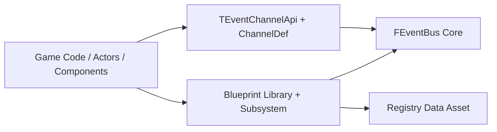
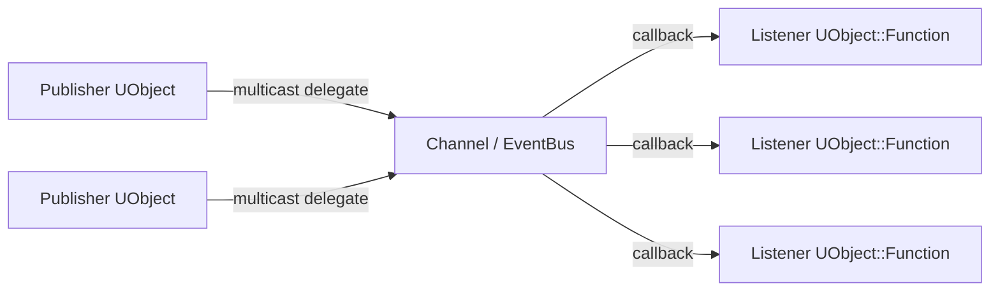
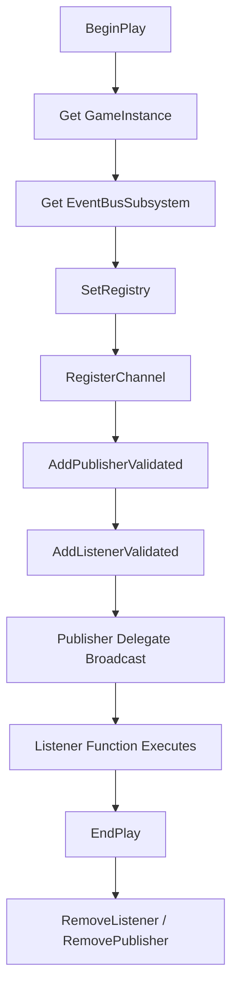

# UEEventBus

UEEventBus is a sample Unreal project hosting the **EventBus v2** plugin (full replacement architecture).

The project includes:

1. EventBus plugin runtime/core implementation.
2. Typed C++ API for static channel contracts.
3. Blueprint facade with registry-controlled binding.
4. Toy hybrid sample (C++ publisher/listener + Blueprint-capable listener path).

## Compatibility Matrix

- Unreal Engine: `>= 5.5` (target baseline configured to 5.5)
- C++: `>= 20`

## Mandatory Engineering Constraints

1. Unreal Engine 5.5+ coding rules and best practices.
2. C++20+ best practices and standards.
3. Prefer Unreal Engine libraries/types over STL where practical.
4. Use well-defined GoF patterns where appropriate.
5. Maintain strong decoupling.
6. Keep naming and formatting coherent.
7. Keep comments, doxygen, and textual docs up to date.
8. Enforce clear responsibility separation between code entities.
9. Follow OOP best practices.
10. Maintain compatibility with C++ `>= 20` and Unreal Engine `>= 5.5` (5.6/5.7+ included).
11. Keep code clean, safe, and well structured.
12. Avoid workarounds and non-canonical code paths.
13. Apply DRY best practices and avoid unnecessary repetition.
14. Avoid dead or unreachable code.

## Repository Structure

```text
UEEventBus/
|- Plugins/EventBus/
|  |- Source/EventBus/Public/EventBus/Core/*
|  |- Source/EventBus/Public/EventBus/Typed/*
|  |- Source/EventBus/Public/EventBus/BP/*
|  `- Source/EventBus/Private/*
|- Source/UEEventBus/
|  |- EventBusToyTags.*
|  |- EventBusToyChannels.h
|  |- ToyStatsPublisherComponent.*
|  `- ToyCppListenerActor.*
`- docs/
   |- EventBus_v2_Architecture.md
   `- EventBus_v2_API.md
```

## Architectural Overview



## Pub/Sub Block Diagram



The runtime is channel-based:

- Channel key: `FGameplayTag`
- Publisher identity: UObject + multicast delegate property name
- Listener identity: UObject + function name (`FObjectKey + FName` internal key)
- Policy: per-channel `bOwnsPublisherDelegates`
- Channel signature is inferred from first publisher delegate and enforced thereafter
- C++ attribute aliases are centralized in `EventBus/Core/EventBusAttributes.h`

## EventBus v2 API (Canonical)

1. `RegisterChannel(ChannelTag, bOwnsPublisherDelegates) -> bool`
2. `UnregisterChannel(ChannelTag) -> bool`
3. `AddPublisher(ChannelTag, PublisherInstance, DelegateBinding) -> bool`
4. `RemovePublisher(ChannelTag, PublisherInstance) -> bool`
5. `AddListener(ChannelTag, ListenerInstance, ListenerFunction) -> bool`
6. `RemoveListener(ChannelTag, ListenerInstance, ListenerFunction) -> bool`

## C++ Integration Quick Start

### 1) Declare gameplay tags

```cpp
UE_DECLARE_GAMEPLAY_TAG_EXTERN(TAG_Event_Toy_HealthChanged);
```

### 2) Define channel contract

```cpp
NFL_DECLARE_EVENTBUS_CHANNEL(
    FToyHealthChangedChannel,
    FOnToyHealthChanged,
    UToyStatsPublisherComponent,
    TAG_Event_Toy_HealthChanged,
    OnToyHealthChanged
);
```

### 3) Register + bind

```cpp
using namespace Nfrrlib::EventBus;

FEventBus& Bus = EventBusSubsystem->GetEventBus();
TEventChannelApi<FToyHealthChangedChannel>::Register(Bus, false);
TEventChannelApi<FToyHealthChangedChannel>::AddPublisher(Bus, PublisherComp);
NFL_EVENTBUS_ADD_LISTENER(Bus, FToyHealthChangedChannel, this, AToyCppListenerActor, OnHealthChanged);
```

## Blueprint Integration Guide

### Step A: Create registry

Create a `UEventBusRegistryAsset` and configure:

- Publisher rules:
  - `ChannelTag`
  - `PublisherClass` (`TSubclassOf<UObject>`)
  - `DelegatePropertyName`
- Listener rules:
  - `ChannelTag`
  - `ListenerClass` (`TSubclassOf<UObject>`)
  - `AllowedFunctions` array

### Step B: Set subsystem registry

In startup Blueprint:

1. Get `GameInstance`
2. Get `EventBusSubsystem`
3. Call `SetRegistry(RegistryAsset)`

### Step C: Register/bind via nodes

Use `UEventBusBlueprintLibrary` nodes:

1. `RegisterChannel`
2. `AddPublisherValidated`
3. `AddListenerValidated`
4. `RemoveListener`
5. `RemovePublisher`
6. `UnregisterChannel`

### Blueprint wiring diagram



## Toy Example Included

The sample includes:

- `UToyStatsPublisherComponent`: exposes `OnToyHealthChanged`, `OnToyStaminaChanged` delegates and broadcasts on updates.
- `AToyCppListenerActor`: binds with typed macro syntax (`NFL_EVENTBUS_ADD_LISTENER(..., AToyCppListenerActor, OnHealthChanged)`).
- Gameplay tags and typed channels under `Source/UEEventBus/EventBusToy*`.

Expected runtime behavior:

1. Publisher component registers channels and itself as publisher in `BeginPlay`.
2. C++ listener registers typed callbacks in `BeginPlay`.
3. Delegate broadcasts route through EventBus channel to listeners.
4. Teardown removes listener/publisher bindings in `EndPlay`.

## Build and Validation Notes

- If you see duplicate filename conflicts in non-unity builds, ensure there is no duplicate `.cpp` basename under the same module.
- Plugin module entry implementation file is `Plugins/EventBus/Source/EventBus/Private/EventBusModule.cpp`.
- Core runtime implementation file is `Plugins/EventBus/Source/EventBus/Private/Core/EventBus.cpp`.

## Documentation Index

- Architecture details: `docs/EventBus_v2_Architecture.md`
- API reference and examples: `docs/EventBus_v2_API.md`
- Plugin-specific detailed guide: `Plugins/EventBus/README.md`
