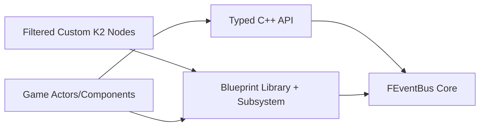
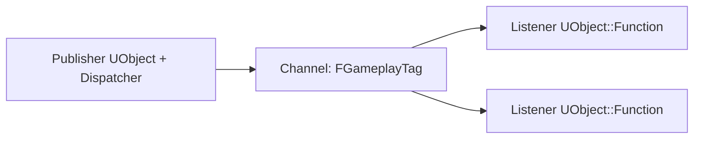

# UEEventBus

UEEventBus is a sample Unreal project that hosts the EventBus v2 plugin.

## Compatibility

- Unreal Engine: `>= 5.5`
- C++: `>= 20`

## Mandatory Engineering Constraints

1. Unreal Engine 5.5+ coding rules and best practices.
2. C++20+ best practices and standards.
3. Prefer Unreal Engine libraries/types over STL where practical.
4. Use well-defined GoF patterns where appropriate.
5. Maintain strong decoupling.
6. Keep naming and formatting coherent.
7. Keep comments, doxygen, and textual docs up to date.
8. Enforce clear responsibility separation between code entities.
9. Follow OOP best practices.
10. Maintain compatibility with C++ `>= 20` and Unreal Engine `>= 5.5` (5.6/5.7+ included).
11. Keep code clean, safe, and well structured.
12. Avoid workarounds and non-canonical code paths.
13. Apply DRY best practices and avoid unnecessary repetition.
14. Avoid dead or unreachable code.

## Runtime Model

EventBus is channel-driven:

1. Register channel.
2. Register publisher(s).
3. Register listener(s).
4. Unregister listener(s).
5. Unregister publisher(s).

The plugin keeps an internal runtime history of successful bindings for BP ergonomics. No manual registry setup is required.

## Architecture

## Pub/Sub Block Diagram

## Plugin Files

- Runtime API: `Plugins/EventBus/Source/EventBus/Public/EventBus/*`
- Runtime implementation: `Plugins/EventBus/Source/EventBus/Private/*`
- Editor nodes: `Plugins/EventBus/Source/EventBusEditor/*`

## Blueprint API

`UEventBusBlueprintLibrary` exposes:

- `RegisterChannel`
- `UnregisterChannel`
- `AddPublisherValidated`
- `AddPublisher`
- `RemovePublisher`
- `AddListenerValidated`
- `AddListener`
- `RemoveListener`
- `GetKnownListenerFunctions`

## Notes

- Validated APIs perform runtime checks and do not require pre-authored rule tables.
- Channel signature is inferred by first publisher delegate bound on channel.
- Listener identity is tracked by instance + function.

## Docs

- `Plugins/EventBus/README.md`
- `docs/EventBus_v2_Architecture.md`
- `docs/EventBus_v2_API.md`
